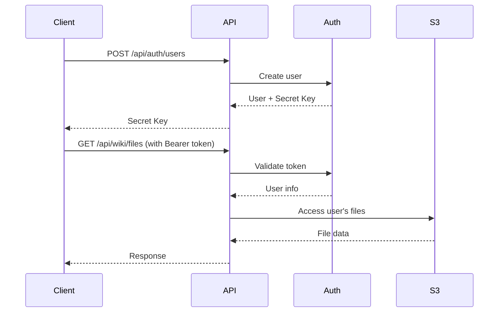

# Authentication API

The authentication system manages users and provides Bearer tokens for API access.

## Overview

- Each user has a unique secret key (Bearer token)
- Users can only access files in their own directory (`users/{userId}/`)
- Secret keys are 64-character hexadecimal strings
- Authentication is required for all wiki operations

## Endpoints

### Create User

**POST** `/api/auth/users`

Create a new user account and receive a secret key.

**Request Body:**
```json
{
  "userId": "string (required) - Unique user identifier",
  "email": "string (optional) - User email address"
}
```

**Response:**
```json
{
  "success": true,
  "user": {
    "id": "john",
    "email": "john@example.com",
    "secretKey": "a1b2c3d4e5f6789...",
    "createdAt": "2024-01-01T00:00:00.000Z",
    "isActive": true
  },
  "message": "User created successfully"
}
```

**Example:**
```bash
curl -X POST "/api/auth/users" \
  -H "Content-Type: application/json" \
  -d '{"userId": "alice", "email": "alice@example.com"}'
```

**Error Responses:**
- `400` - Missing userId
- `409` - User already exists

---

### Get User Information

**GET** `/api/auth/users/[userId]`

Retrieve user information including the secret key.

**Parameters:**
- `userId` (path) - User ID to retrieve

**Response:**
```json
{
  "success": true,
  "user": {
    "id": "john",
    "email": "john@example.com",
    "secretKey": "a1b2c3d4e5f6789...",
    "createdAt": "2024-01-01T00:00:00.000Z",
    "lastUsed": "2024-01-01T12:00:00.000Z",
    "isActive": true
  }
}
```

**Example:**
```bash
curl -X GET "/api/auth/users/alice"
```

**Error Responses:**
- `400` - Missing userId
- `404` - User not found

---

### Regenerate Secret Key

**POST** `/api/auth/users/[userId]/regenerate-key`

Generate a new secret key for a user. Requires authentication with current key.

**Parameters:**
- `userId` (path) - User ID

**Headers:**
```
Authorization: Bearer CURRENT_SECRET_KEY
```

**Response:**
```json
{
  "success": true,
  "secretKey": "new_secret_key_here...",
  "message": "Secret key regenerated successfully"
}
```

**Example:**
```bash
curl -X POST "/api/auth/users/alice/regenerate-key" \
  -H "Authorization: Bearer current_secret_key"
```

**Error Responses:**
- `400` - Missing userId
- `401` - Invalid authentication
- `403` - Access denied (wrong user)
- `404` - User not found

---

### Verify Authentication

**GET** `/api/auth/verify`

Verify that your authentication token is valid.

**Headers:**
```
Authorization: Bearer YOUR_SECRET_KEY
```

**Response:**
```json
{
  "success": true,
  "user": {
    "id": "alice",
    "email": "alice@example.com",
    "lastUsed": "2024-01-01T12:00:00.000Z",
    "isActive": true
  },
  "message": "Authentication successful"
}
```

**Example:**
```bash
curl -X GET "/api/auth/verify" \
  -H "Authorization: Bearer your_secret_key"
```

**Error Responses:**
- `401` - Invalid or missing authentication token

## Security Features

1. **Secure Key Generation**: Uses `crypto.randomBytes(32).toString('hex')`
2. **Path-based Authorization**: Users can only access their own directories
3. **Activity Tracking**: Last used timestamp is updated on each request
4. **Token Validation**: All requests validate the Bearer token

## Authentication Flow



## Demo Users

The system initializes with demo users for testing:
- `demo` / `demo@example.com`
- `alice` / `alice@example.com`
- `bob` / `bob@example.com`

## Best Practices

1. **Store Secret Keys Securely**: Never expose secret keys in client-side code
2. **Use HTTPS**: Always use HTTPS in production
3. **Regenerate Keys**: Periodically regenerate secret keys for security
4. **Monitor Usage**: Track the `lastUsed` field for inactive accounts